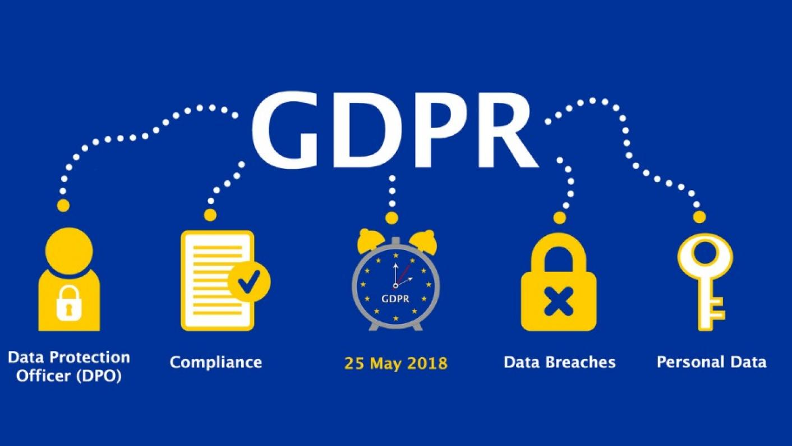

# GDPR and Data Science

General data protection regulation (GDPR) is applicable from 25 May 2018.

https://gdpr-info.eu/ - unofficial but easier to browse

https://ico.org.uk/for-organisations/guide-to-the-general-data-protection-regulation-gdpr/ - UK guide, similar to our Valsts Datu Inspekcija

http://www.dvi.gov.lv/en/

## What Data is covered by GDPR?

**Personal data’** means any information relating to an identified or identifiable natural person (‘data subject’).

“[A]n identifiable natural person is one who can be identified, directly or indirectly, in particular by reference to an identifier such as a name, an identification number, location data, an online identifier or to one or more factors specific to the physical, physiological, genetic, mental, economic, cultural or social identity of that natural person.”

Janis Berzins or infamously Ojars Grinbergs by itself is not personal data, it needs additional information(such as address or phone) to become personal data.

Depending on **context** some of the following could become **personal data**

* Biographical information or current living situation, including dates of birth, Social Security numbers, phone numbers and email addresses.
* Looks, appearance and behaviour, including eye colour, weight and character traits.
* Workplace data and information about education, including salary, tax information and student numbers.
* Private and subjective data, including religion, political opinions and geo-tracking data.
* Health, sickness and genetics, including medical history, genetic data and information about sick leave.

## Not covered:
Properly pseudo-anonymized personal data, data about everything else(weather, insects, dogs, cats, etc, etc, as long as it can not be used to rebuild into personal data).

## Collecting Data

* Opt-in ONLY Ask not assume consent!
* Granular strongly preferred

1. The vital interest of the individual
2. The public interest
3. Contractual necessity
4. Compliance with legal obligations
5. Unambiguous consent of the individual - THE Opt-IN mentioned
6. Legitimate interest of the data controller

**bundling** a big no no now - can't require consent for unrelated purposes

## Data Wrangling and Feature Engineering

**Non-discrimination Right**  
GDPR limits prediction/profiling based on personal data revealing racial or ethnic origin, political opinions, religious or philosophical beliefs, or trade union membership, and the processing of genetic data, biometric data for the purpose of uniquely identifying a natural person, data concerning health or data concerning a natural person's sex life or sexual orientation

## Modelling Explanation

According to the GDPR owner’s rights, the data subject (the user/customer) has the **right to explanation**. For machine learning, this refers to the fact that the data processor must provide meaningful information about the logic involved, as well as the significance and the envisaged consequences of such processing for the data subject.

The data subject should have the right not to be subject to a decision, which may include a measure, evaluating personal aspects relating to him or her which is based solely on automated processing and which produces legal effects concerning him or her or similarly significantly affects him or her, such as automatic refusal of an online credit application or e-recruiting practices without any human intervention.

**not really tested yet in courts** but assumed to refer to loan decisions, school admissions and similar important decisions.

## Deployment, Retraining, and Model Update

**Right to be Forgotten**

* The GDPR introduces a right for individuals to have personal data erased.
* The right to erasure is also known as ‘the right to be forgotten’.
* Individuals can make a request for erasure verbally or in writing.
* You have one month to respond to a request.
* The right is not absolute and only applies in certain circumstances.
* This right is not the only way in which the GDPR places an obligation on you to consider whether to delete personal data.

**Time limit on user data** - how long can you keep data? Still not tested

## GDPR not yet tested on big cases

https://noyb.eu/ - Austrian activist filed in May of 2018 against Google,Facebook but cases not yet settled.

# Big Data and Ethics

https://www.amazon.com/Weapons-Math-Destruction-Increases-Inequality/dp/0553418815

# Summary

* ask for consent
* use only what you need
* anonymize
* protect/encrypt

